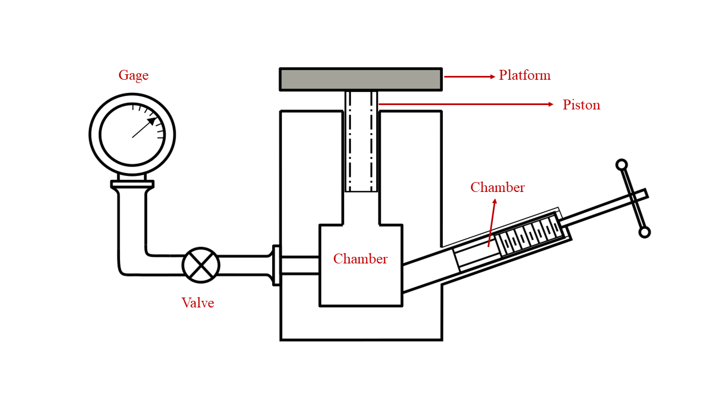

### Procedure

**Schematic of the Coupled-Tank Plant**

            

**Steps to perform the simuation**

1. Place the pressure gauge in the appropriate position for it to remain fixed.

2. To calibrate the dead weight gauge, fill the barrel of the calibrator with oil.

3. Take a reading of the piston's weight as well as the area of its cross section.

4. By turning the hand wheel, you can apply pressure to the oil until it reaches the desired level, which will be indicated when the plunger reaches the mark that serves as a reference.

5. Put a weight that you are familiar with on the plunger's platform.

6. Take note of the reading on the pressure gauge, then conduct the experiment again using a plunger that has a different weight attached to it.

7. Determine the actual pressure by making use of the weights that are known along with the cross-sectional area, and then evaluate this pressure in relation to the pressure that is indicated by the pressure gauge.

8. During the unloading process, remove the mass block that was just most recently added and make a note of the reading on the pressure gauge.

9. Repeat the step as many times as necessary until all of the mass blocks have been eliminated completely.

  